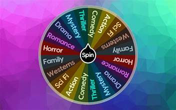
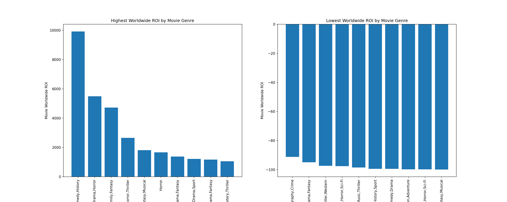

# Microsoft Movie Business Entry Analysis
***

## Project Overview
***

This project explores data from the movie review databases IMDB, Rotten Tomatoes, Box Office Mojo, TheMovieDB and The Numbers to determine which movies are currently doing well at the box office. Exploratory data analysis will shed insight that can be used by Microsoft's new movie studio to determine the kind of original video content they should create.

## Business Problem
***  

Microsoft want to venture into film making business and needs to know what types of films are currently doing the best at the box office. This analysis will provide insights into the film types they can explore as a new movie studio.  

## The Data
***

The datasets have been derived from the movie review databases IMDB, Rotten Tomatoes, Box Office Mojo, TheMovieDB and The Numbers. These datasets contain information on films including film genre, runtime, domestic and worldwide grossing and rating among other variables. 

## Methods
***

This project uses exploratory data analysis to determine which film types are highest rated at the box office and production budgets and return on investment by movie genre.  

## Results
***

The highest rated movies come from the genres Documentary/Family/Romance while the lowest rated ones are of the genre Adventure/Drama/Musical.  

The most expensive film genres to produce are Adventure/Fantasy while the cheapest to produce are Documentary/Drama/Sport. 

The film genres with the highest domestic return on investment are Action/Comedy/History while the greatest loss makers in the domestic market are Drama/History/Sport 

The film genres with the highest worldwide return on investment are Action/Comedy/History while the greatest loss makers worldwide market are Comedy/Fantasy/Musical  

     
     
There is no relationship between production budget and return on investment

There is no relationship between production budget and return on investment  

## Conclusions
***

This analysis leads to the following recommendations to the head of Microsoft's new Movie Studio in terms of the types of films to create:

1. __Starting with films of the genre documentary is a good move.
2. __Action and adventure are another genre that Microsoft's new studio can look into.__ 
3. __Drama and comedy genre films must be approached with caution.__ 
4. __Rating and production budgets are not indicators of return on investment.__ 

## Further Analysis
***

Further analysis can be conducted to determine:
1. The predictors of a film's return on investments
2. The effect of director/writer on a film's rating and popularity
3. The effect or runtime in minutes on a movie's rating and return on investment. 

